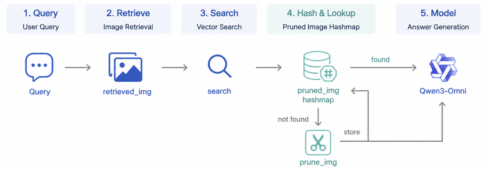
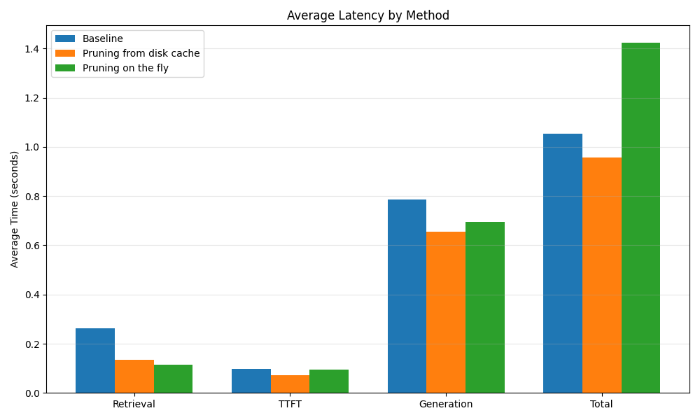
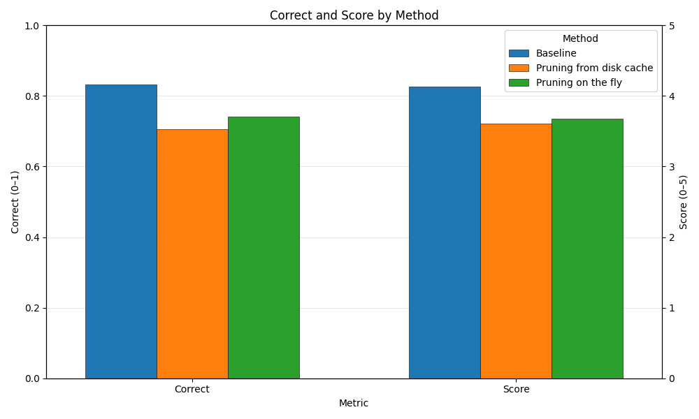

# Query-Aware Visual Token Pruning and Disk Cache in Multimodal RAG

This repository studies **modality policy** for multimodal RAG: after hybrid text-and-image retrieval, retrieved document images are **pruned in a query-conditioned way** so the VLM sees fewer visual tokens. Pruned images can be **written to disk** and indexed in a small JSON cache. When a later query is **similar** (embedding cosine similarity above a threshold) to a cached entry for the **same document image**, the pipeline **reuses the stored pruned image** instead of recomputing pruning, which reduces **time to first token (TTFT)** and end-to-end latency while keeping the same retrieval setup.

**Tested hardware:** NVIDIA H200 (your environment may differ; see [requirements.txt](requirements.txt) for CUDA / vLLM-oriented pins).


## Prerequisites

- Linux-style environment with a **CUDA-capable NVIDIA GPU** suitable for vLLM.
- Install conda, then create the env:
```
conda env create -f environment.yml
```

Activate the env:
```
conda activate mrag
```


## Running the VLM (vLLM OpenAI server)

The client uses OpenAI-compatible URLs from `RAGConfig` (`vlm_api_base`, default `http://127.0.0.1:8000/v1`; offline judge uses `judge_api_base`, same default). Start the server from the repo root in **one terminal**:

```bash
PYTHONPATH=$PYTHONPATH:. \
python -m vllm.entrypoints.openai.api_server \
  --model Qwen/Qwen3-Omni-30B-A3B-Instruct \
  --max-model-len 16384 \
  --gpu_memory_utilization=0.5 \
  --host 0.0.0.0 \
  --port 8000
```

### Optional: vLLM with LMCache

Point `LMCACHE_CONFIG_FILE` at your [config.yaml](config.yaml). Align the LMCache storage location in that file with `RAGConfig.lmcache_path` in [rag/config.py](rag/config.py) (used when the benchmark script measures disk usage under that path).

```bash
PYTHONPATH=$PYTHONPATH:. \
LMCACHE_CONFIG_FILE="config.yaml" \
python -m vllm.entrypoints.openai.api_server \
  --model Qwen/Qwen3-Omni-30B-A3B-Instruct \
  --max-model-len 16384 \
  --gpu_memory_utilization=0.5 \
  --host 0.0.0.0 \
  --port 8000 \
  --kv-transfer-config '{"kv_connector":"LMCacheConnectorV1","kv_role":"kv_both"}'
```

## Running the MMDocRAG benchmark

In **another terminal** (with the server still running), from the repo root:

```bash
# Example: JSONL lines [0, 50), no extra cap on row count (see --max-examples 0)
PYTHONPATH=$PYTHONPATH:. python scripts/run_mmodcrag_benchmark.py --eval-slice-start 0 --eval-slice-stop 50 --max-examples 0

# Example: from line index 100, at most 15 examples
PYTHONPATH=$PYTHONPATH:. python scripts/run_mmodcrag_benchmark.py --eval-slice-start 100 --max-examples 15
```

The script runs an **online** RAG pass ([rag/eval.py](rag/eval.py) `run_rag_benchmark`), then an **offline** LLM-as-judge pass (`run_rag_benchmark_offline_judge`), and writes an aggregate JSON including optional LMCache / host utilization.

## Outputs (default `data/mmdocrag/outputs/`)

| Artifact | Description |
| -------- | ----------- |
| `baseline_predictions.json` | Per-example predictions and lexical / retrieval metrics from the online pass |
| `baseline_results_judged.json` | Same rows with LLM-judge fields; the benchmark wrapper may append an `lmcache` block here |
| `image_prune_cache.json` | Disk cache index for reused pruned images (path configurable via `image_prune_cache_path`) |
| `pruned_images/` (under output dir) | Pruned image files (see `pruned_image_dir` in config) |
| `final_results_with_utilization.json` | Summary + rows + `lmcache` and system utilization from [scripts/run_mmodcrag_benchmark.py](scripts/run_mmodcrag_benchmark.py) |


## Figures







