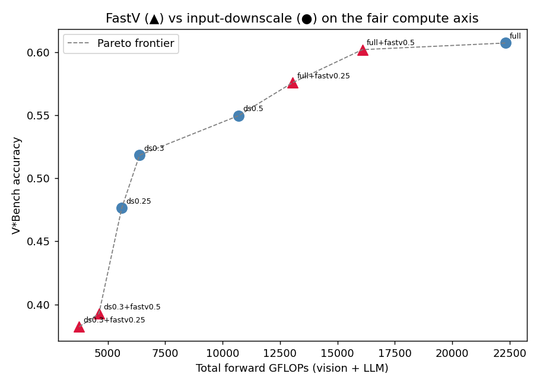

# Query-Aware Visual Token Pruning and Disk Cache in Multimodal RAG

This repository studies **modality policy** for multimodal RAG: after hybrid text-and-image retrieval, retrieved document images are **pruned in a query-conditioned way** so the VLM sees fewer visual tokens. Pruned images can be **written to disk** and indexed in a small JSON cache. When a later query is **similar** (embedding cosine similarity above a threshold) to a cached entry for the **same document image**, the pipeline **reuses the stored pruned image** instead of recomputing pruning, which reduces **time to first token (TTFT)** and end-to-end latency while keeping the same retrieval setup.

**Tested hardware:** NVIDIA H200 (your environment may differ; see [requirements.txt](requirements.txt) for CUDA / vLLM-oriented pins).

## Research findings (read this)

The project's single goal is to **reduce the visual tokens a VLM consumes after
multimodal retrieval, without hurting answer quality or net latency.** Building honest
measurement (token counts on the *target* model, n≥191–300, bootstrap + paired CIs)
turned the work into a rigorous study, summarized in
**[thoughts/work_report/2026-06-19-project-summary-visual-token-reduction.md](thoughts/work_report/2026-06-19-project-summary-visual-token-reduction.md)**.
The headline:

- **MMDocRAG can't prove a visual-token method.** Its accuracy/token frontier is flat —
  downscaling to ~150 tokens (a 90% cut) loses nothing, because the answer lives in the
  retrieved *text* quotes. So the study moved to **detail-sensitive VQA (V\*Bench)**,
  where downscaling provably hurts.
- **In-model pruning (FastV) only *looks* like it beats input-side downscaling.** At a
  matched *deep-layer token* budget FastV wins by +0.099; but on honest **total compute**
  the edge collapses, because FastV still encodes the full image:

  | FastV advantage over input-downscale | r=0.25 | r=0.5 |
  |---|---|---|
  | deep-layer tokens (original axis) | +0.099 | +0.052 |
  | analytical total FLOPs (matched) | +0.015 | +0.026 |
  | **measured latency (matched)** | **+0.002** | **+0.019** |

  The vision tower is a constant **51–55% of FastV's latency** — a cost it cannot avoid.
- **Cheap input-side reduction is the efficient lever, but making it *adaptive* is hard.**
  A learned global-scalar budget policy and a query-conditioned crop both failed to beat
  plain uniform downscaling — cheap CLIP features can't predict per-example downscale
  sensitivity, and single-shot localization misses the small objects visual search
  depends on. That gap is the open problem.

**Methodological takeaway:** always measure visual-token-reduction methods on a cost axis
that **includes the vision encoder**; "deep-layer tokens" flatters in-model pruning and
unfairly penalizes input-side reduction.

## Prerequisites

- Linux-style environment with a **CUDA-capable NVIDIA GPU** suitable for vLLM.
- Install conda, then create the env:
```
conda env create -f environment.yml
```

Activate the env:
```
conda activate mrag
```


## Running the VLM (vLLM OpenAI server)

The client uses OpenAI-compatible URLs from `RAGConfig` (`vlm_api_base`, default `http://127.0.0.1:8000/v1`; offline judge uses `judge_api_base`, same default). Start the server from the repo root in **one terminal**:

```bash
PYTHONPATH=$PYTHONPATH:. \
python -m vllm.entrypoints.openai.api_server \
  --model Qwen/Qwen3-Omni-30B-A3B-Instruct \
  --max-model-len 16384 \
  --gpu_memory_utilization=0.5 \
  --host 0.0.0.0 \
  --port 8000
```

### Optional: vLLM with LMCache

Point `LMCACHE_CONFIG_FILE` at your [config.yaml](config.yaml). Align the LMCache storage location in that file with `RAGConfig.lmcache_path` in [rag/config.py](rag/config.py) (used when the benchmark script measures disk usage under that path).

```bash
PYTHONPATH=$PYTHONPATH:. \
LMCACHE_CONFIG_FILE="config.yaml" \
python -m vllm.entrypoints.openai.api_server \
  --model Qwen/Qwen3-Omni-30B-A3B-Instruct \
  --max-model-len 16384 \
  --gpu_memory_utilization=0.5 \
  --host 0.0.0.0 \
  --port 8000 \
  --kv-transfer-config '{"kv_connector":"LMCacheConnectorV1","kv_role":"kv_both"}'
```

## Running the MMDocRAG benchmark

In **another terminal** (with the server still running), from the repo root:

```bash
# Example: JSONL lines [0, 50), no extra cap on row count (see --max-examples 0)
PYTHONPATH=$PYTHONPATH:. python scripts/run_mmodcrag_benchmark.py --eval-slice-start 0 --eval-slice-stop 50 --max-examples 0

# Example: from line index 100, at most 15 examples
PYTHONPATH=$PYTHONPATH:. python scripts/run_mmodcrag_benchmark.py --eval-slice-start 100 --max-examples 15
```

The script runs an **online** RAG pass ([rag/eval.py](rag/eval.py) `run_rag_benchmark`), then an **offline** LLM-as-judge pass (`run_rag_benchmark_offline_judge`), and writes an aggregate JSON including optional LMCache / host utilization.

## Outputs (default `data/mmdocrag/outputs/`)

| Artifact | Description |
| -------- | ----------- |
| `baseline_predictions.json` | Per-example predictions and lexical / retrieval metrics from the online pass |
| `baseline_results_judged.json` | Same rows with LLM-judge fields; the benchmark wrapper may append an `lmcache` block here |
| `image_prune_cache.json` | Disk cache index for reused pruned images (path configurable via `image_prune_cache_path`) |
| `pruned_images/` (under output dir) | Pruned image files (see `pruned_image_dir` in config) |
| `final_results_with_utilization.json` | Summary + rows + `lmcache` and system utilization from [scripts/run_mmodcrag_benchmark.py](scripts/run_mmodcrag_benchmark.py) |


## Visual-token-reduction study (code & reproduction)

Beyond the MMDocRAG pipeline above, the repo contains a self-contained single-image VQA
study (no RAG server needed for analysis; the stress tests need the VLM). Key pieces:

| Module / script | Purpose |
| --- | --- |
| `rag/visual_token_counter.py` | count visual tokens on the **target** model's processor |
| `rag/metrics.py` | bootstrap + paired-difference CIs |
| `rag/vqa_datasets.py` | loaders: V\*Bench, DocVQA, HR-Bench |
| `rag/image_ops.py` | `downscale_to_keep`, `trim_downscale` transforms |
| `scripts/downscale_stress_test.py` + `analyze_stress_test.py` | the **gate**: does downscaling provably hurt? |
| `rag/fastv.py` + `scripts/run_fastv_matrix.py` | faithful **FastV** in-model pruning on Qwen2-VL-7B |
| `rag/budget_features.py` + `rag/budget_policy.py` + `scripts/train_budget_policy.py` | learned per-example budget policy (negative result) |
| `rag/foveated_crop.py` + `scripts/run_foveated_crop.py` | query-conditioned crop (Angle 2) |
| `rag/flops_model.py` + `scripts/angle1_flops_reframing.py` + `scripts/angle1_measure_latency.py` | **fair-cost reframing** (Angle 1): FLOPs + measured latency |

Per-phase write-ups are in [thoughts/work_report/](thoughts/work_report/); design
decisions are in [thoughts/plans/](thoughts/plans/). Run tests with
`PYTHONPATH=. python -m pytest tests/ -q`.

## Figures

**Headline result — FastV (▲) vs input-downscale (●) on the fair compute axis:** FastV's
token-budget advantage shrinks to near-zero once the full-image vision-encoder cost it
pays is counted.




