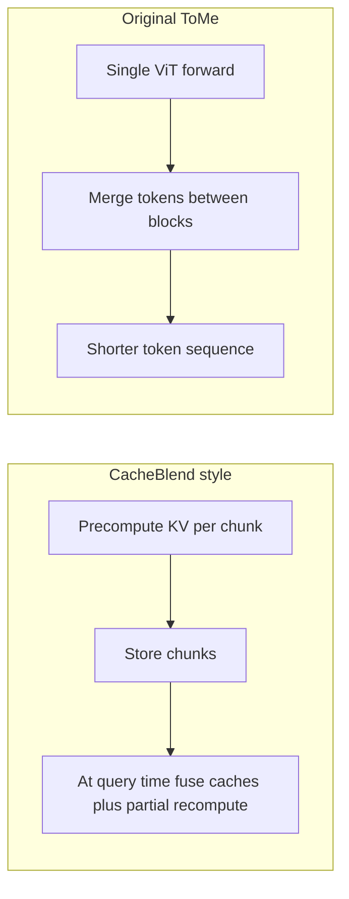

# ToMe, KV compression, and CacheBlend-style reuse

This document records how **Token Merging (ToMe)**, **KV cache compression**, and **CacheBlend-style reuse** relate to each other, and how they map onto this repository’s architecture.

## Direct answer

**There is no standard “ToMe variant” that implements CacheBlend’s pattern** (offline KV storage + online fusion with the live query prefix). The [facebookresearch/ToMe](https://github.com/facebookresearch/ToMe) method targets **Vision Transformers**: it merges similar **image patch tokens** during a forward pass to speed up ViT inference. It is not defined for **decoder KV caches**, **prefix–suffix composition**, or **selective partial recomputation** across retrieved chunks.

**ToMe-inspired ideas** (merge redundant tokens using similarity) can inspire KV compression, but **you should not expect an existing ToMe fork to plug into a CacheBlend pipeline** without substantial redesign.

## How this differs from CacheBlend



- **CacheBlend** ([arXiv:2405.16444](https://arxiv.org/abs/2405.16444)): addresses **non-prefix** reuse of precomputed KVs for RAG by **fusing** caches and **recomputing a small subset** of positions so attention stays consistent with the actual prompt order.
- **ToMe** ([arXiv:2210.09461](https://arxiv.org/abs/2210.09461)): **inference-time merging** inside a ViT stack to reduce FLOPs/tokens; **no** notion of retrieving stored KVs from disk and blending with a new query.

Those are orthogonal concerns: **chunk fusion** vs **within-forward token reduction**.

## Closest relatives for “ToMe-like merging” on KV (LLMs)

These are **not** ToMe rebrands, but they apply **similarity-based merging** to **K/V tensors** for **long-context LLM** inference (closer to a “compress KV” goal than original ToMe):

| Direction | Example | Relevance |
| --------- | ------- | --------- |
| Adaptive KV merging | [“Model Tells You Where to Merge” / KVMerger](https://arxiv.org/abs/2407.08454) | Merges similar KV positions; **single-sequence** long context |
| Zero-shot merge | [ZSMerge](https://arxiv.org/abs/2503.10714) | Residual-style merging + importance weighting; **no retraining** |
| Ecosystem | [KVPress](https://github.com/NVIDIA/kvpress) (NVIDIA) | **Compression primitives** for KV in serving stacks |

These still **do not** replace CacheBlend’s **RAG-specific** problem (arbitrary chunk order + cross-chunk attention correction). A plausible pipeline is: **compress each chunk’s KV** with a merging method, **then** **fuse** with CacheBlend-style logic—that is a **research/engineering integration**, not a shipped “ToMe for CacheBlend” product.

## Project scope (goal clarification)

For **this** codebase and experiments:

| Topic | Role in this repo |
| ----- | ----------------- |
| **In-sequence KV merging** (ToMe-like / ZSMerge / KVMerger) | **Not implemented** in Python here; would live **inside vLLM or the model** if pursued. |
| **CacheBlend-style multi-cache fusion** | **Not implemented** here; same as above—**orthogonal** to LMCache’s storage/transfer. |
| **Both** | Treat as **separate layers**: merging shrinks KV **per sequence**; CacheBlend addresses **how** multiple caches combine with a query. Either or both can be future inference-side work. |
| **Multimodal (Qwen-Omni)** | Compression policy should name its target: **vision encoder tokens** vs **decoder text KV** (and how images are projected into the LM). Original ToMe aligns most naturally with **vision**; **decoder KV merging** follows the LLM papers above. |

**LMCache + vLLM** in this project handle **where** KVs are stored and moved, not ToMe- or CacheBlend-style algorithms.

## Inference stack (vLLM + LMCache)

The server is started from the repo root via [`start_server.sh`](../start_server.sh), for example:

```bash
LMCACHE_CONFIG_FILE="config.yaml" \
vllm serve Qwen/Qwen3-Omni-30B-A3B-Instruct \
  --max-model-len 16384 \
  --gpu_memory_utilization 0.5 \
  --kv-transfer-config '{"kv_connector":"LMCacheConnectorV1", "kv_role":"kv_both"}'
```

[`config.yaml`](../config.yaml) configures LMCache (chunk size, backends, policy). That stack handles **KV storage and transfer**. **ToMe-style merging** or **CacheBlend-style fusion** remain **separate** and would require support **inside vLLM / the model**, not something implied by LMCache alone.

## Repo context

The RAG entrypoint [`rag/query_pipeline.py`](../rag/query_pipeline.py) calls the **VLM over HTTP**. It does not implement custom KV compression or multi-cache fusion. Any ToMe-like **compression** on top of cached KVs is an **inference-engine / research** layer on top of the server command above.
